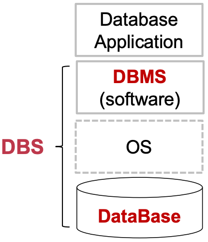
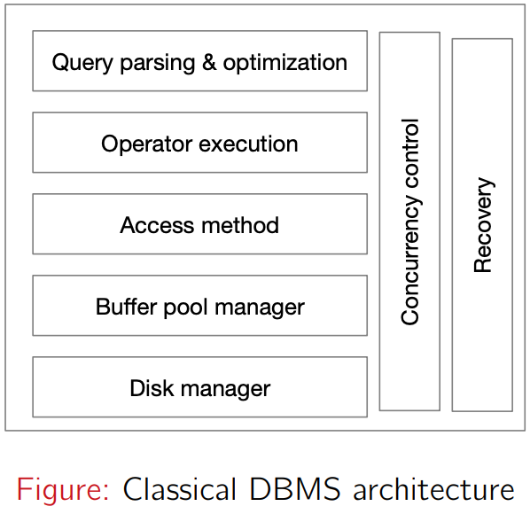
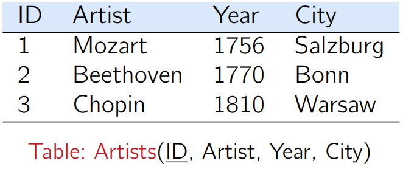
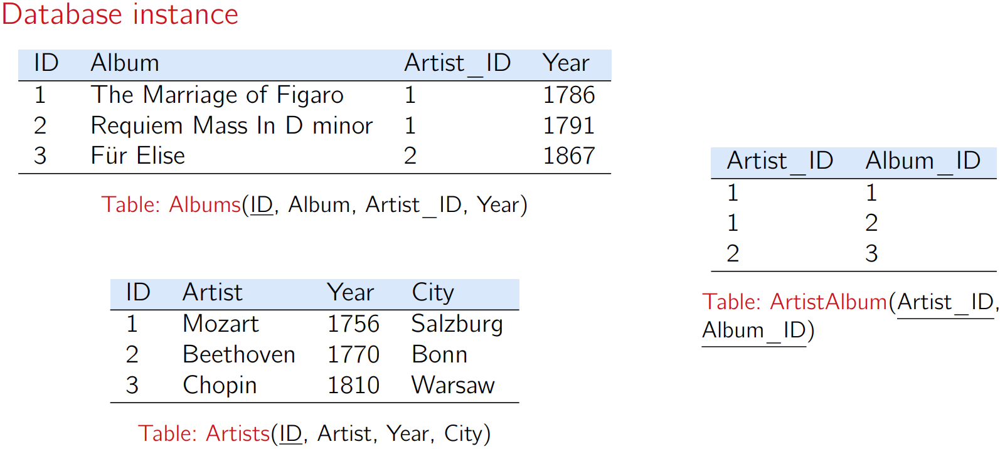
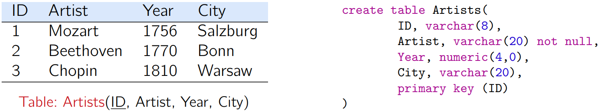
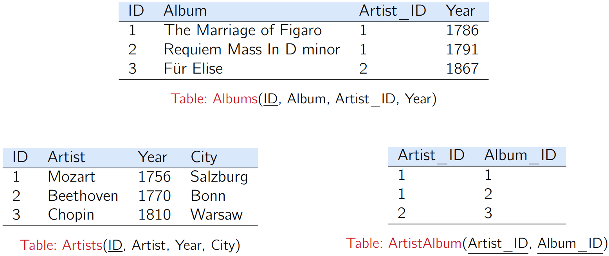
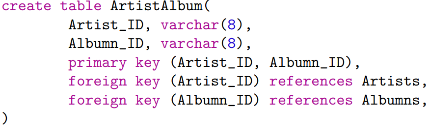

# Note 1: Introduction

- <https://www.cs.sjtu.edu.cn/~qyin/teaching/db2024/Lec1-Intro.pdf>

## DBS

- **Database**: an organized collection of inter-related data that models some aspect of the real-world.
- **Database management system (DBMS)**: a software system that facilitates the creation, maintenance and uses of databases.
- **Database system**: DBMS + Database

## Flat File

- data integrity
- implementation
- durability

## The Relational Revolution

- [Edgar F. Codd](https://en.wikipedia.org/wiki/Edgar_F._Codd) (Edgar Frank Codd) proposed the **relational data model** in 1970.
- The most successful database abstraction
	1. Store database in simple data structures
	2. Access data through high-level language
	3. Physical storage left up to implementation
- ⇒ Provides **physical data independence**.

## DBMS

- A DBMS is software system that facilitates the creation, maintenance and uses of databases.
	- Persistent storage of database
	- Data abstraction: logical data model, declarative query language, integrity constraints.
	- Efficient query processing.
	- Concurrency control for high throughput transactions.
	- **Resilient** to system failures.

## Relational Databases

- Relational data model
- Relational algebra
- Structured query language (SQL)
- Relational database design theory

## DBMS Internals

- Database storage
- Indexing
- Query processing and optimization
- Concurrency control
- Crash recovery

## Data Models

- A **data model** is a collection of concepts/tools for describing the data in a database.
	- Relational (focus of this course)
	- Key-value
	- Graph
	- Column-family
	- Document
	- Vector
- Relational model is still the **dominating** technology today.

- See: https://db-engines.com/en/ranking_categories

## Relational Data Model

- A database is a collection of relations and each **relation** is an unordered set of **tuples** (or **rows**).
- Each relation has a set of **attributes** (or **columns**).
- Each attribute has a name and a **domain** and each tuple has a **value** for each attribute of the relation.
- **Values** are atomic/scalar.

## Schema vs. Instance

- Let A1, …, An be attributes.
- R(A1, A2, . . . , An) is a **relational schema**.
- A schema specifies the logical structure of data.
- **Relational instance**: concrete table content w.r.t. a given schema.
  – set of tuples (also called **records**) matching the scheme.
- A schema rarely changes after being defined, while an instance often changes rapidly.
- Example.
	- A relational schema: `Artists(ID, Artist, Year, City)`. 
	- Below is an instance for the schema `Artists(ID, Artist, Year, City)`.

## Database Schema vs. Database Instance

- Database Scheme
	- `Artists (ID, Artist, Year, City)`
	- `Albums (ID, Album, Artist_ID, Year)`
	- `ArtistAlbum (Artist_ID, Album_ID)`
- Database Instance

## Keys

- K ⊆ {A1, A2, . . . , An} is a **superkey** of schema R(A1, . . . , An) if values for K are sufficient to identify a **unique** tuple for each **possible** relation instance of R(A1, A2, . . . , An).
- A superkey K is a **candidate key** if K is **minimal**.

## Primary Key

- A primary key is a **designated** candidate key of a relation.
- Some DBMSs automatically create an **internal primary key** if we don’t define one.

## Foreign Key

- A **foreign key** specifies that a tuple from one relation must map to a tuple in another relation.

- **Foreign key constraint**
	- The referencing attribute(s) must be the **primary key** of the referenced relation.
	- **Referencing relation**: ArtistAlbum
	- **Referencing attributes**: Artist_ID, Album_ID
	- **Referenced relations**: Artist, Album

---

Last Updated: Wed Oct  2 22:48:16 CST 2024