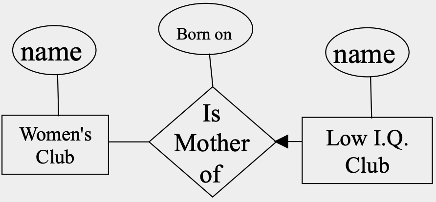

# Note 3: Entity-Relationship (ER) Model
{: .no_toc }

## Table of Contents
{: .no_toc .text-delta }

1. TOC
{:toc}

- **<https://www.cs.virginia.edu/~up3f/cs4750/slides/4750meet04-ER-intro.pdf>**
- **<https://www.cs.virginia.edu/~up3f/cs4750/slides/4750meet05-ER.pdf>**
- **<https://www.cs.virginia.edu/~up3f/cs4750/slides/4750meet06-07-ER.pdf>**
- <https://codex.cs.yale.edu/avi/db-book/slides-dir/PDF-dir/ch6.pdf>

## https://cs.gmu.edu/~jessica/cs450_s12/cs450_ER1.pdf

### The Entity-Relationship Model

The **E-R** (entity-relationship) data model views the real world as a set of basic **objects** (entities) and **relationships** among these objects.

It is intended primarily for the DB design process by allowing the specification of an **enterprise scheme**. This represents the overall logical structure of the DB.

### Entities and Entity Sets

- An **entity** is an object that exists and is distinguishable from other objects. For instance, Michelle Lee with S.S.N. 890-12-3456 is an entity, as she can be uniquely identified as one particular person in the universe.
- An entity may be **concrete** (a person or a book, for example) or **abstract** (like a holiday or a disease).
- An **entity set** is a set of entities of the same type (e.g., all persons having an account at a bank).
- Entity sets **need not be disjoint**. For example, the entity set *Student* (all students in a university) and the entity set *professor* (all professors in a university) may have members in common. (i.e a computer science professor might take a class in anthropology).
- An entity is represented by a set of **attributes**. (e.g. *name*, *SSN*, *Phone-Num* for “customer” entity.)
- The **domain** of the attribute is the set of permitted values (e.g. the telephone number must be ten positive integers).
- Formally, an attribute is a **function** which maps an entity set into a domain.
- Every entity is described by a set of (attribute, data value) pairs. There is one pair for each attribute of the entity set.
- e.g. a particular *student* entity is described by the set `{(name, Lee), (SSN, 890-123-456), (street, Blaine), (city, Riverside)}`.

### E-R diagrams

We can express the overall logical structure of a database **graphically** with an E-R diagram.

Its components are:
- **rectangles** representing entity sets.
  矩形：实体集
- **ellipses** representing attributes.
  椭圆：属性
	- 下划线：主键属性
- **diamonds** representing **relationship** sets.
  菱形：联系
- **lines** linking attributes to entity sets and entity sets to relationship sets.
  线条：连接属性和实体集、连接实体集和关系集

> Note that this is a poor example of a entity, since the name is represented as one attribute and there is no street number attribute. We will consider the problem of designing good entities later, here we are just concerned with explaining their graphical representation. Also note that one of the attributes is underlined, we will explain why later.

> The “since” attribute in this example is called a descriptive attribute, since it describes the mapping from A to B

### Key Constraints

We can also use arrows to indicate **key constraints** (often simply referred to as **constraints**)

Suppose the university has the following rule: **A student is allowed to be advised by at most one professor. However, a professor is allowed to advise more than one student.**

This is an example of a **many-to-one constraints**, that is, many students can be advised by one professor, but each student can only have (at most) one advisor. We can represent this with an arrow as shown below.

- There are four possible **key constraints**, they express the number of entities to which another entity can be associated via a relationship. For binary relationship sets between entity sets A and B, the mapping cardinality must be one of:

1. **One-to-one**: An entity in A is associated with at most one entity in B, and an entity in B is associated with at most one entity in A.
2. **One-to-many**: An entity in A is associated with any number in B. An entity in B is associated with at most one entity in A.
3. **Many-to-one**: An entity in A is associated with at most one entity in B. An entity in B is associated with any number in A.
4. **Many-to-many**: Entities in A and B are associated with any number from each other.

The appropriate **key constraint** for a particular relationship set depends on the real world being modeled.

### Key Constraints: Examples

- **One-to-one**: An entity in A is associated with at most one entity in B, and an entity in B is associated with at most one entity in A.
- A man may be married to at most one woman, and a woman may be married to at most one man (both men and women can be unmarried)

- **One-to-many**: An entity in A is associated with any number in B. An entity in B is associated with at most one entity in A.
- A woman may be the mother of many (or no) children. A person may have at most one mother.

> Note that this example is not saying that Moe does not have a mother, since we know as a biological fact that everyone has a mother. It is simply the case that Moeʼs mom is not a member of the Womenʼs club.

- **Many-to-one**: An entity in A is associated with at most one entity in B. An entity in B is associated with any number in A.
- Many people can be born in any county, but any individual is born in at most one country.

> Note that we are not saying that the Sea Captain was not born in any country, he almost certainly was, we just donʼt know which country, or it is not in our Country entity set. Also note that we are not saying that no one was born in Ireland, it is just that no one in the Bowling Club was.

- **Many-to-many**: Entities in A and B are associated with any number from each other.

### Key Constraints Summary

- The arrow positioning is simple once you get it straight in your mind, so do some examples. Think of the arrow head as pointing to the entity that “ one ” refers to.
- Some people use the term “**Mapping Cardinalities**” or “**Multiplicity**” to refer to key constraints.

### Participation Constraints

Earlier, we saw an example of a one-to-one key constraint, noting that a man may be married to at most one woman, and a woman may be married to at most one man (both men and women can be unmarried).

Suppose we want to build a database for the “Springfield Married Persons Association”. In this case *everyone* must be married! In database terms their participation must be **total**. (the previous case that allows unmarried people is said to have **partial** participation.)

How do we represent this with ER diagrams?

Participation Constraints are indicated by bold lines in ER diagrams.

We can use bold lines (to indicate participation constraints), and arrow lines (to indicate key constraints) independently of each other to create an expressive language of possibilities.

### More on Relations

- Entities sets can be related to themselves.

> We can annotate the **roles** played by the entities in this case. Suppose that we want to pair a mature student with a novice student...

> When entities are related to themselves, it is almost always a good idea to indicate their roles.

### Entity Attributes Revisited

- What is the correct choice of attributes to represent height?
	- Using two fields, one for *feet* the other for *inches* is probably the best solution if we are never going to do arithmetic on the height, and you need to report the height in a human intuitive way (dating agency).
	- If we are going to do calculations on the data (i.e calculate the BMI) we would be much better off with just the height in inches. (medical records)

### Entity versus Attribute

Sometimes we have to decide whether a property of the world we want to model should be **an attribute of an entity**, or an **entity set which is related to the attribute by a relationship set**.

A major advantage of the latter approach is that we can easily model the fact that a person can have multiple phones, or that a phone might be shared by several students. (attributes can not be set-valued)

A classic example of a feature that is best modeled as a an entity set which is related to the attribute by a relationship set is an address.

> Very bad choice for most applications. It would make it difficult to pretty print mailing labels, it would make it difficult to test validity of the data, it would make it difficult/impossible to do queries such as “how many students live in Fairfax?”

> A better choice, but it only allows a student to have one address. Many students have a two or more address (i.e. a different address during the summer months) This method cannot handle this.

The best choice for this problem

### Domains Revisited

We already said…
The **domain** of the attribute is the set of permitted values (e.g. the telephone number must be ten positive integers).

Defining the correct **domain** for an attribute is an important skill.
Making a mistake at this stage can cause huge problems later on.

What is the **domain** for GENDER?
- is it MALE, FEMALE, MIXED? (Olympics)
- is it MALE, FEMALE, UNKNOWN? (Fossils)
- is it MALE, FEMALE, DECLINE TO STATE? (Politically Correct)

- What is the correct domain for GPA?
- What is the correct domain for street address?
- What is the correct domain for Phone Number? (What about foreign … )
- What is the correct domain for Bank Account Balance?

### Summary of Conceptual Design

- ***Conceptual design*** follows ***requirements analysis***
	- Yields a high-level description of data to be stored
- ER model is popular for conceptual design
	- Constructs are expressive, close to the way people think about their applications
- Basic constructs:
	- ***entities***,
	- ***relationships***,
	- ***attributes*** (of *entities* and *relationships*).
- Constraints can be expressed
- Note: There are many variations on ER model.

## https://cs.gmu.edu/~jessica/cs450_s12/cs450_ER2.pdf

### Keys

Differences between entities must be expressed in terms of attributes.

- A **superkey** is a set of one or more attributes which, taken collectively, allow us to identify uniquely an entity in the entity set.
- For example, in the entity set *student*, `{name, S.S.N.}` is a superkey.
- Note that *name* alone is not, as two students could have the same name.
- A superkey may contain extraneous attributes, and we are often interested in the smallest superkey. A superkey for which no subset is a superkey is called a **candidate key**.

| Name | S.S.N.      |
| ---- | ----------- |
| Lisa | 111-11-1111 |
| Bart | 222-22-2222 |
| Lisa | 333-33-3333 |
| Sue  | 444-44-4444 |

> We can see that `{Name,S.S.N.}` is a **superkey**
> 
> In this example, `S.S.N.` is a **candidate** key, as it is minimal, and uniquely identifies a students entity.

- A **primary key** is a candidate key (there may be more than one) chosen by the DB designer to identify entities in an entity set.

In the example below…

`{Make,Model,Owner,State,License#,VIN#}` is a superkey
`{State,License#,VIN#}` is a superkey
`{Make,Model,Owner}` is *not* a superkey

`{State,License#}` is a candidate key
`{VIN#}` is a candidate key

`VIN#` is the logical choice for **primary key**

- The **primary key** is denoted in an ER diagram by underlining.
- An entity that has a primary key is called a **strong entity**.

> Note that a good choice of primary key is very important!
> 
> For example, it is usually much faster to search a database by the primary key, than by any other key (we will see why later).

An entity set that does not possess sufficient attributes to form a primary key is called a **weak entity set**.

In the example below, there are two different sections of Java being offered (let’s say, for example, one by Dr. Smith, one by Dr. Lee).

`{Name,Number}` is not a superkey, and therefore *course* is a **weak entity**.

This is clearly a problem, we need some way to distinguish between different courses….

In order to be able to uniquely refer to an item in a weak entity set we must consider some (or all) of its attributes in conjunction with some strong entities primary key. The entity whose primary key is being used is called the identifying owner.

For this to work, two conditions must be met.

- The weak entity set must have total participation in the relationship
- The identifying owner and the weak entity must participate is a one-to-many relationship.

### Weak Entity Sets Example

- Entity sets Teams, and Players.
	- No team has two players with the same number.
	- However, there can be players with the same number on different teams

### Ternary Relationships

So far, we have only considered binary relationships, however it is possible to have **higher order** relationships, including **ternary** relationships.

Consider the following example that describes the fact that employees at a bank work in one or more bank branches, and have one or more job descriptions.

Sometimes you have a choice of a single ternary relationship or two binary relationships…

> In general, unless you really need a ternary relationship, use binary relationships.
> 
> **FACT**: Every ternary (and higher order) relationship can be converted into a set of binary relationships.

### Aggregation

### ISA (is a) Hierarchies

### ER Design Decisions

- The use of an attribute or entity set to represent an object.
- Whether a real-world concept is best expressed by an entity set or a relationship set.
- The use of a ternary relationship versus a pair of binary relationships.
- The use of a strong or weak entity set.
- The use of aggregation – can treat the aggregate entity set as a single unit without concern for the details of its internal structure.

### Entity vs. Attribute

Should address be an attribute of Employees or an entity (connected to Employees by a relationship)? • Depends upon the use we want to make of address information, and the semantics of the data: • If we have several addresses per employee, address must be an entity (since attributes cannot be set-valued). • If the structure (city, street, etc.) is important, e.g., we want to retrieve employees in a given city, address must be modeled as an entity (since attribute values are atomic).

Works_In4 does not allow an employee to work in a department for two or more periods. • Similar to the problem of wanting to record several addresses for an employee: We want to record several values of the descriptive attributes for each instance of this relationship. • Solution?

### Entity vs. Relationship

This ER diagram OK if a manager gets a separate discretionary budget for each dept. • What if a manager gets a discretionary budget that covers all managed depts? – Redundancy: dbudget stored for each dept managed by manager. – Misleading: Suggests dbudget associated with department-mgr combination.

### Binary vs. Ternary Relationships

Previous example illustrated a case when two binary relationships were better than one ternary relationship. • An example in the other direction: a ternary relation Contracts relates entity sets Parts, Departments and Suppliers, and has descriptive attribute qty. No combination of binary relationships is an adequate substitute: – S “can-supply” P, D “needs” P, and D “deals-with” S does not imply that D has agreed to buy P from S. – How do we record qty?

### Summary of Conceptual Design

Conceptual design follows requirements analysis, – Yields a high-level description of data to be stored • ER model popular for conceptual design – Constructs are expressive, close to the way people think about their applications. • Basic constructs: entities, relationships, and attributes (of entities and relationships). • Some additional constructs: weak entities, ISA hierarchies, and aggregation.

Several kinds of integrity constraints can be expressed in the ER model: key constraints, participation constraints, and overlap/covering constraints for ISA hierarchies. • Some constraints (notably, functional dependencies) cannot be expressed in the ER model. – Constraints play an important role in determining the best database design for an enterprise.

ER design is subjective. There are often many ways to model a given scenario! Analyzing alternatives can be tricky, especially for a large enterprise. Common choices include: – Entity vs. attribute, entity vs. relationship, binary or n-ary relationship, whether or not to use ISA hierarchies, and whether or not to use aggregation. • To ensure good database design, resulting relational schema should be analyzed and refined further. FD information and normalization techniques are especially useful.

### Practice Question

• Construct an ER diagram for a car insurance company whose customers own one or more cars each. Each car has associated with it zero to any number of recorded accidents. – Entity Sets: ? – Relationship: ?

---

## E-R diagram

- **E-R diagram**: high-level design model representing a database as a **collection of entities and relationships** among entities
- **Entity**: ~an object (thing to keep track to run the business)
- **Entity set**: ~a class (~table, a collection of things of the same kind)
- **Instance** ~actual occurrence of the entity (~row in a table)
- **Attribute** ~ a field (property of the entities in that set)

## Attributes

- **Single-valued attribute** – allows a single value
- **Multi-valued attribute** – allows multiple values at the same time
- **Derived attribute** –can be calculated from one or more attributes
- **Composite attribute**
	- consists of multiple values
	- can have as many levels as needed

## Relationships

- Connections among two or more entity sets
- **Binary relationships** – connections between two entity sets
- **Multi-way relationships (u-ary)** – connections involving more than two entity sets

## Binary Relationships

- If A and B are sets, a relationship R is a subset of A X B
- Cardinality (or Multiplicity)
	- A binary relationship can connect any member of one of its entity sets to any number of members of the other entity set

## Total Participation

- **Total participation** – all entities in an entity set **must** participate in the relationship

---

Last Updated: Mon Oct  7 12:07:08 CST 2024

